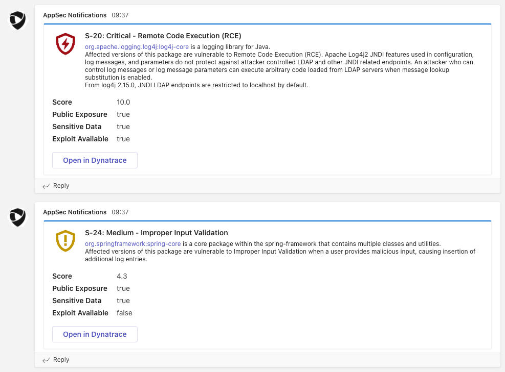
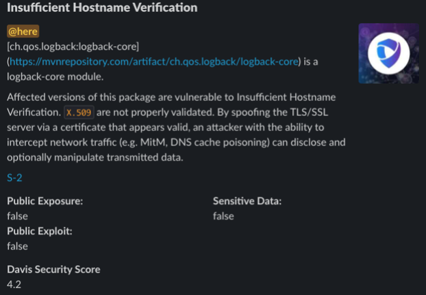
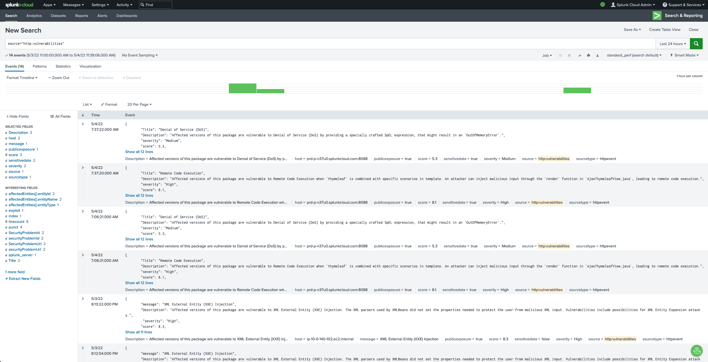

# Configuration for Dynatrace Security Notifications

## Teams
- [Create a Teams Webhook integration](https://docs.microsoft.com/en-us/microsoftteams/platform/webhooks-and-connectors/how-to/add-incoming-webhook#create-an-incoming-webhook-1)
- Configure the notification integration in Dynatrace:
  - Webhook URL: the previously created slack webhook endpoint
  - Configure the payload

Example payload:
```JSON
{
    "@type": "MessageCard",
    "@context": "http://schema.org/extensions",
    "themeColor": "0076D7",
    "summary": "{SecurityProblemId}: {Severity} - {Title}",
    "sections": [{
        "activityTitle": "{SecurityProblemId}: {Severity} - {Title}",
        "activitySubtitle": "{Description}",
        "activityImage": "https://github.com/robinwyss/appsec-integrations/raw/main/assets/security-{Severity}.png",
        "facts": [{
            "name": "Score",
            "value": "{DavisSecurityScore}"
        }, {
            "name": "Public Exposure",
            "value": "{Exposed}"
        }, {
            "name": "Sensitive Data",
            "value": "{SensitiveDataReachable}"
        },
        {
            "name": "Exploit Available",
            "value": "{ExploitAvailable}"
        }],
        "markdown": true
    }],
    "potentialAction": [{
        "@type": "OpenUri",
        "name": "Open in Dynatrace",
        "targets": [{
            "os": "default",
            "uri": "{SecurityProblemUrl}"
        }]
    }]
}
```
This creates a card in the teams channel for every new vulnerability. The card contains the description and details about the vulnerability and a link to Dynatrace.



## Slack

- [Create a Slack Webhook](https://api.slack.com/messaging/webhooks)
- Configure the notification integration in Dynatrace:
  - Webhook URL: the previously created slack webhook endpoint
  - Configure the payload

Example payload:
```JSON
{
    "text": "{Title}",
    "blocks": [
    	{
    		"type": "header",
    		"text": {
    			"type": "plain_text",
    			"text": "{Title}"
    		}
    	},
    	{
    		"type": "section",
    		"block_id": "section567",
    		"text": {
    			"type": "mrkdwn",
    			"text": "<!here>\n{Description}\n\n<{SecurityProblemUrl}|{SecurityProblemId}>"
    		},
    		"accessory": {
    			"type": "image",
    			"image_url": "https://marvel-b1-cdn.bc0a.com/f00000000236551/dt-cdn.net/wp-content/uploads/2021/11/11103_RC_Blog_AppSec_800x450_FINAL-2-300x169.jpg",
    			"alt_text": "Haunted hotel image"
    		}
    	},
        {
			"type": "section",
			"fields": [
				{
					"type": "mrkdwn",
					"text": "*Public Exposure:*\n{Exposed}"
				},
				{
					"type": "mrkdwn",
					"text": "*Sensitive Data:*\n{SensitiveDataReachable}"
				},
				{
					"type": "mrkdwn",
					"text": "*Public Exploit:*\n{Exposed}"
				}
			]
		},
    	{
    		"type": "section",
    		"block_id": "section789",
    		"fields": [
    			{
    				"type": "mrkdwn",
    				"text": "*Davis Security Score*\n{DavisSecurityScore}"
    			}
    		]
    	}
    ]
}
```


## Splunk
- [Setup an HTTP Event Collector in Splunk](https://docs.splunk.com/Documentation/Splunk/latest/Data/UsetheHTTPEventCollector)
- Configure the notification integration in Dynatrace:
  - Webhook URL: <URL to your splunk instance>/services/collector/event 
  - Add and additional header: `Authorization: Splunk <TOKEN>`
  - Configure the Payload

Example payload:
```JSON
{
    "event": {
        "Title": "{Title}",
        "Description": "{Description}",
        "severity": "{Severity}",
        "score": {DavisSecurityScore},
        "publicexposure": true,
        "sensitivedata": {SensitiveDataReachable},
        "exploit": {ExploitAvailable},
        "securityProblemId":"{SecurityProblemId}",
        "securityProblemUrl":"{SecurityProblemUrl}",
         "affectedEntities": {AffectedEntities}
    }
}
```
